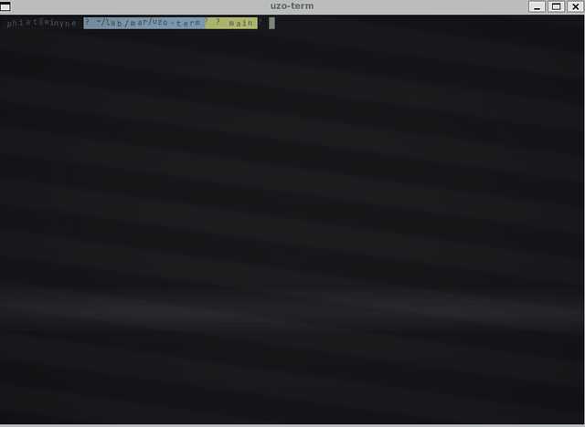

# uzo-term

[](LICENSE)
[](https://odin-lang.org/)
[](https://ziglang.org/)
[](https://www.raylib.com/)
[](https://github.com/phiat/ghosdin)
[](#)

<p align="center">
  
</p>

A graphical terminal emulator with visual effects, built on [ghostty-vt](https://github.com/ghostty-org/ghostty) + [raylib](https://www.raylib.com/) in [Odin](https://odin-lang.org/).

Everything renders to a RenderTexture2D first, then composites through a post-processing shader pass. A 3D camera draws a background scene of animated wireframe cubes; the terminal is overlaid in 2D with transparency.

## Effects

| Effect | Trigger | Description |
|--------|---------|-------------|
| Screen shake | Enter | Screen jolts on command submit |
| Enter explosion | Enter | Particles burst from the cursor line |
| Key raindrop | Any keypress | Character falls from screen center to cursor position |
| Cursor trail | Any keypress | Ghost cursor outlines fade behind the cursor |
| Cursor gravity well | Always | Nearby glyphs bend toward the cursor |
| Typing rhythm | Keypresses | Fast typing warms the screen (orange glow), slow cools it |
| Idle drift | 4s no input | All glyphs drift on sine waves; keypress snaps back |
| Line age decay | Continuously | Old rows fade to ~42% brightness over time |
| Character glitch | PTY output | Random cells briefly show substitute characters |
| `ls` race-in | `ls` command | Output characters race in from the left with bounce |
| `cd` fly-through | `cd` command | Camera flies to a new angle; dir name shown on cubes |
| `sudo` vignette | `sudo` command | Pulsing accent-colored border while elevated |
| `exit` doom drip | `exit` command | Screen melts downward; "GAME OVER" appears |
| Scanline refraction | Always (shader) | Sweeping scan bar refracts and reflects off text |
| CRT scanlines | Always (shader) | Static horizontal lines that glow on text |

## Configuration

All effect parameters are runtime-configurable via CLI args:

```
just run --rand                       # randomize everything (effects + color palette)
just run --shake-intensity=15         # override a single param
just run --rand --explode-count=50    # randomize then override
```

Available params: `shake-duration`, `shake-intensity`, `trail-fade`, `gravity-radius`, `gravity-strength`, `warmth-decay`, `warmth-per-key`, `warmth-max`, `glitch-duration`, `glitch-scatter`, `idle-delay`, `idle-drift`, `cam-duration`, `explode-count`.

`--rand` also randomizes the color palette (HSV-derived: background, foreground, accent, 3D scene) and prints all rolled values to stderr.

## Build

Requires Odin (nightly), Zig 0.15.2 (pinned in `.mise.toml`), raylib, and
a clone of [ghosdin](https://github.com/phiat/ghosdin) as a sibling
directory (`../ghosdin`) — uzo-term reuses its libghostty-vt build and
its `pty/` + `vendor/ghostty_vt/` packages.

```
git clone https://github.com/phiat/ghosdin.git ../ghosdin
just build    # build libghostty-vt + uzo-term
just run      # build + run
just check    # type-check only
```

### Fonts

uzo-term prefers JetBrains Mono Nerd Font and falls back through several
system paths (DejaVu Sans Mono, raylib default). To use the preferred
font without installing it system-wide, drop the TTFs into a local
`fonts/` directory (gitignored):

```
mkdir -p fonts
curl -L -o fonts/JetBrainsMonoNerdFont-Regular.ttf \
  https://github.com/ryanoasis/nerd-fonts/raw/master/patched-fonts/JetBrainsMono/Ligatures/Regular/JetBrainsMonoNerdFont-Regular.ttf
```

## Project structure

```
main.odin      Terminal core: PTY, input, rendering, 3D scene
effects.odin   All visual effects (shake, trail, glitch, particles, etc.)
config.odin    Effect_Config struct, --rand, CLI arg parsing
shaders/       Post-processing GLSL (shimmer, scanlines, refraction)
docs/          Design notes and ideas
```
